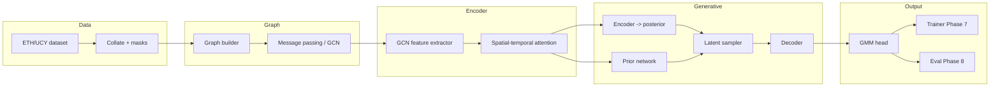

# Architecture overview (GSTGM)

High-level module graph; core paths (data → graph → encoder → generative → decoder/GMM → train/eval) are implemented through **Phase 8**.

## Paper mapping (checklist)

| Paper concept | Code location (phase) |
|---------------|------------------------|
| Scene-centric graph | `gstgm/graph/graph_builder.py` |
| Similarity-based adjacency | `gstgm/graph/adjacency.py`, `gstgm/graph/kernels.py` |
| Graph convolution / message passing | `gstgm/graph/message_passing.py` |
| Spatial attention over neighbors | `gstgm/models/spatial_temporal_attention.py` (Phase 4) |
| Temporal self-attention | same module (Phase 4) |
| Generative latent model | `gstgm/models/generative_encoder.py`, `gstgm/models/prior_network.py`, `gstgm/models/latent_sampler.py` (Phase 5) |
| Decoder + future conditioning | `gstgm/models/decoder.py` (Phase 6) |
| Multi-path GMM prediction | `gstgm/models/gmm_head.py`, `gstgm/models/gstgm.py` (Phase 6) |
| Training loop, losses, ADE/FDE val | `gstgm/training/` (Phase 7), `scripts/train.py` |
| Test-time eval + checkpoint load | `gstgm/evaluation/` (Phase 8), `scripts/evaluate.py` |
| Docs / install parity | `README.md`, `docs/*`, `requirements.txt` (Phase 9) |
| Smoke tests (config, graph, model forward) | `tests/` (Phase 10), `pytest.ini` |

## Configuration keys

See `configs/default.yaml` (and scene files that extend it) for `experiment.*`, `data.*`, `graph.*`, `attention.*`, `model.*`, `generative.*`, `gmm.*`, `training.*`, and `evaluation.*`.

## Tensor conventions

Explicit shapes (batch, time, agents, features) are documented in module docstrings. **GSTGM Eq. (2)** builds adjacency from **node velocities** ``[B, T, N, 2]``, not positions; see `gstgm.graph.graph_builder.SceneGraphBatch`.
